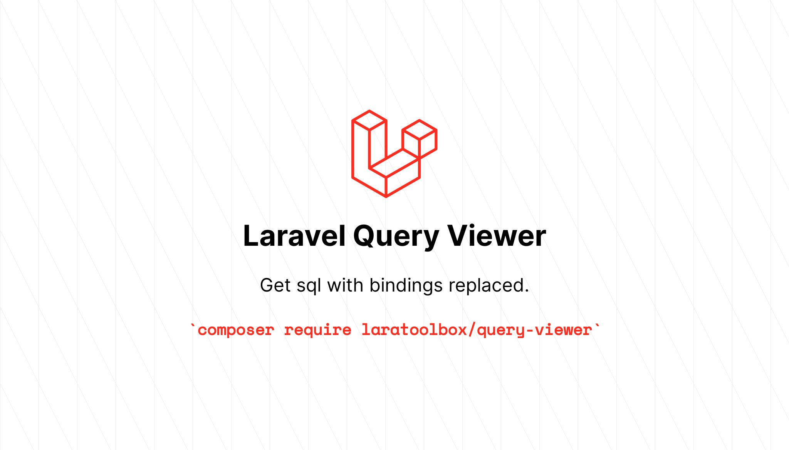

# Query Viewer



[](https://github.com/laratoolbox/query-viewer/actions)

[](https://packagist.org/packages/laratoolbox/query-viewer)
[](https://packagist.org/packages/laratoolbox/query-viewer)
[](https://packagist.org/packages/laratoolbox/query-viewer)

This package adds methods for getting sql query to eloquent and database query builder.

## Requirement

Laravel >= 5.5

## Installation

Install via composer
```bash
composer require laratoolbox/query-viewer
```

### Publish package config

```bash
php artisan vendor:publish --provider="LaraToolbox\QueryViewer\QueryViewerServiceProvider"
```

## Usage

After installing this package you may use these methods on eloquent and db builder.

- `getSql`
  * This method returns sql query.
  * Differences between `toSql` and this method is this method returns sql with question marks (?) replaced.

- `dumpSql`
  * This method prints sql query and returns builder.

- `logSql`
  * This method logs sql query and returns builder.
  * Log type can be set in config file.

- `getSqlFunc`
  * This method takes closure and gives sql string as parameter.
  * Returns builder.

## Examples

#### Eloquent

```php
// With eloquent
use App\Models\User;

User::select('name')->where('id', 5)->getSql();
// 'select `name` from `users` where `id` = 5'

User::select('name')
    ->where('id', 5)
    ->dumpSql()
    ->where('name', '!=', 'john')
    ->dumpSql()
    ->where('surname', '!=', 'doe')
    ->logSql('SURNAME_QUERY') // logs sql to log file.
    ->where('email', 'LIKE', '%example%')
    ->getSqlFunc(function(string $sql) {
        echo $sql;
    })
    ->get();
// select `name` from `users` where `id` = 5
// select `name` from `users` where `id` = 5 and `name` != 'john'
// select `name` from `users` where `id` = 5 and `name` != 'john' and `surname` != 'doe' and `email` LIKE '%example%'
// []
```

#### Database Builder

```php
// With database builder
\DB::table('users')->select('name')->where('id', 5)->getSql();
// 'select `name` from `users` where `id` = 5'

\DB::table('users')
    ->where('id', 5)
    ->dumpSql()
    ->where('name', '!=', 'john')
    ->dumpSql()
    ->where('surname', '!=', 'doe')
    ->logSql('SURNAME_QUERY') // logs sql to log file.
    ->where('email', 'LIKE', '%example%')
    ->getSqlFunc(function(string $sql) {
        echo $sql;
    })
    ->get();
// select `name` from `users` where `id` = 5
// select `name` from `users` where `id` = 5 and `name` != 'john'
// select `name` from `users` where `id` = 5 and `name` != 'john' and `surname` != 'doe' and `email` LIKE '%example%'
// []
```

## Security

If you discover any security related issues, please email
instead of using the issue tracker.

## Credits

- [All contributors](https://github.com/laratoolbox/query-viewer/graphs/contributors)

 - This package is bootstrapped with the help of [melihovv/laravel-package-generator](https://github.com/melihovv/laravel-package-generator).

- Social image generated using [https://banners.beyondco.de/](https://banners.beyondco.de/)
